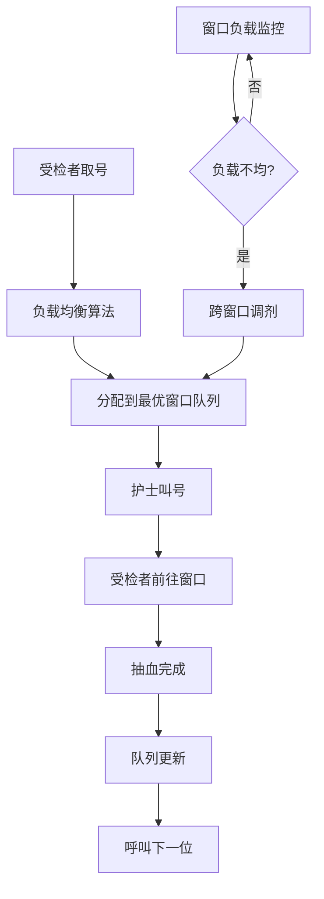
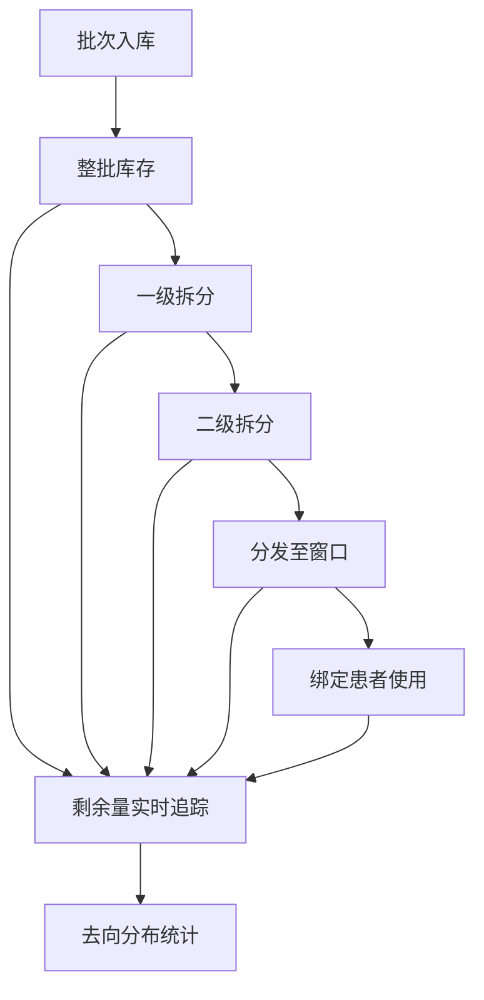

## 1. 产品概述

体检中心抽血排队管理系统，解决多窗口并行叫号与试管库存管理问题。通过智能负载均衡算法，将受检者引导至最空闲窗口，提升抽血效率；同时实现试管批次拆分出库与全流程追踪，确保耗材管理精细化。

- **核心问题**：多窗口排队效率不均、试管耗材追溯困难、人工调度效率低
- **目标用户**：体检中心护士、检验科管理人员、体检中心运营人员
- **产品价值**：提升抽血效率30%+，实现试管全生命周期追溯，降低管理成本

## 2. 核心功能

### 2.1 用户角色

| 角色 | 登录方式 | 核心权限 |
|------|----------|----------|
| 护士端 | 工号登录 | 叫号、完成抽血、查看窗口队列、试管出库 |
| 管理端 | 管理员账号 | 窗口配置、批次管理、数据统计、系统设置 |
| 受检者 | 无需登录 | 取号、查看排队状态（大屏展示） |

### 2.2 功能模块

1. **并行叫号模块**：取号排队、多窗口并行叫号、叫号提醒、状态流转
2. **负载均衡模块**：智能分流算法、窗口负载监控、跨窗口调剂、最优窗口推荐
3. **试管批次模块**：批次入库、批次信息管理、批次绑定患者、有效期管理
4. **拆分出库模块**：批次拆分、多级拆分追踪、剩余量实时监控、去向分布统计

### 2.3 页面详情

| 页面名称 | 模块名称 | 功能描述 |
|----------|----------|----------|
| 叫号工作台 | 并行叫号模块 | 护士操作主界面，显示当前叫号、队列列表、叫号/完成/跳过操作 |
| 负载监控大屏 | 负载均衡模块 | 实时显示各窗口排队人数、等待时间、负载状态、调剂建议 |
| 批次管理 | 试管批次模块 | 批次列表、新增批次、批次详情、批次与患者绑定记录 |
| 拆分出库 | 拆分出库模块 | 批次拆分操作、拆分历史、剩余量追踪、去向分布图 |
| 取号页 | 并行叫号模块 | 受检者取号界面，输入信息获取排队号 |
| 排队大屏 | 并行叫号模块 | 公共区域显示当前叫号、各窗口状态、等待人数 |

## 3. 核心流程

### 3.1 取号叫号流程

受检者取号后，系统根据负载均衡算法分配到最优窗口队列。护士叫号后，受检者前往对应窗口抽血，完成后系统自动更新队列状态并呼叫下一位。当某窗口积压严重时，系统自动发起跨窗口调剂建议。

### 3.2 试管拆分出库流程

整批试管入库后，可根据使用需求进行多级拆分。每次拆分记录来源批次、拆分数量、去向窗口/人员，实时追踪剩余量。使用时将试管条码与患者绑定，实现全链条追溯。

## 4. 用户界面设计

### 4.1 设计风格

- **主色调**：医疗蓝 (#1E88E5) 作为主色，传达专业、信任的医疗感
- **辅助色**：薄荷绿 (#26A69A) 用于成功/正常状态，橙红 (#FF7043) 用于警告/繁忙状态
- **中性色**：深灰 (#37474F) 文字，浅灰背景 (#ECEFF1)，白色卡片
- **按钮风格**：圆角8px，主按钮有微阴影，hover有缩放反馈
- **字体**：标题使用思源黑体 Bold，正文使用思源黑体 Regular，数字使用等宽字体
- **布局风格**：卡片式布局，顶部导航 + 左侧菜单 + 主内容区
- **图标风格**：线性图标，2px描边，医疗主题

### 4.2 页面设计概览

| 页面名称 | 模块名称 | UI 元素 |
|----------|----------|---------|
| 叫号工作台 | 并行叫号模块 | 大字号当前号码卡片、队列列表、操作按钮组、窗口状态指示灯 |
| 负载监控大屏 | 负载均衡模块 | 多窗口卡片横向排列、负载进度条、实时数据动画、调剂提示弹窗 |
| 批次管理 | 试管批次模块 | 批次列表表格、批次详情抽屉、新增批次表单、状态标签 |
| 拆分出库 | 拆分出库模块 | 树状拆分结构图、剩余量仪表盘、去向分布饼图、拆分操作表单 |
| 取号页 | 并行叫号模块 | 大号取号按钮、表单输入、号码显示动画、排队信息提示 |
| 排队大屏 | 并行叫号模块 | 超大号叫号显示、多窗口状态栏、滚动等待列表、语音播报提示 |

### 4.3 响应式

- 桌面端优先设计，适配1920×1080及以上分辨率
- 叫号工作台适配平板横屏使用
- 排队大屏适配电视/显示器大屏展示（1080p/4K）
- 取号页适配自助机触摸屏操作

### 4.4 动效设计

- 叫号时号码卡片有脉冲放大动画
- 队列更新有平滑过渡效果
- 负载变化有进度条缓动动画
- 拆分操作有树形展开动效
- 页面切换有淡入淡出过渡
