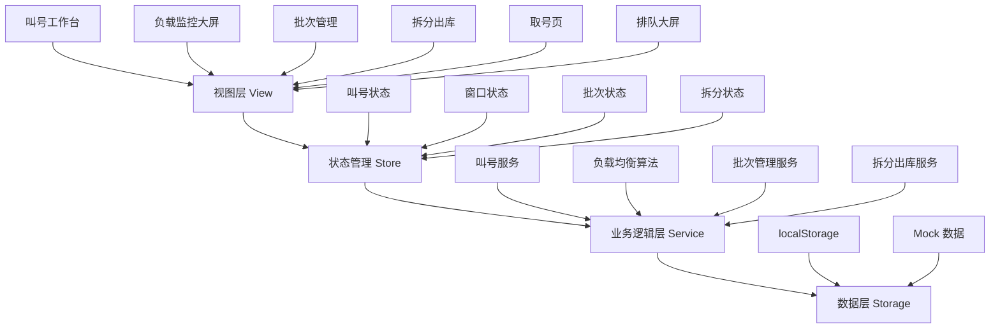
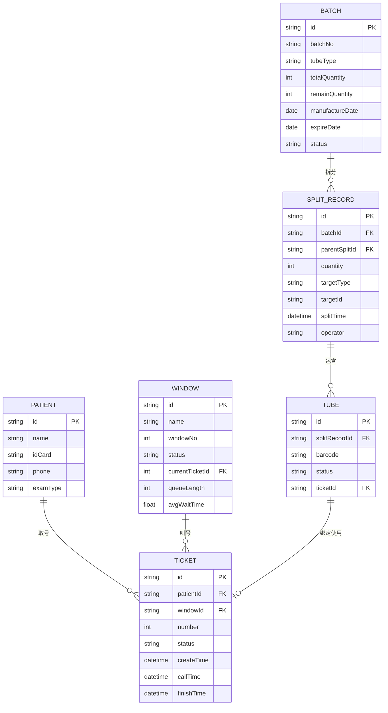

## 1. 架构设计

本系统为纯前端应用，采用React单页应用架构，数据存储在浏览器localStorage中模拟后端。整体分为视图层、状态管理层、业务逻辑层和数据层。



## 2. 技术描述

- **前端框架**：React@18 + TypeScript
- **构建工具**：Vite@5
- **样式方案**：TailwindCSS@3 + CSS Variables
- **状态管理**：Zustand（轻量级状态管理）
- **路由管理**：React Router@6
- **图表库**：Recharts（用于去向分布、负载图表）
- **图标库**：Lucide React（线性图标库）
- **动画库**：Framer Motion（页面过渡、微交互动画）
- **数据持久化**：localStorage + Zustand persist
- **UI组件**：基于TailwindCSS自定义组件，不引入重型UI库

## 3. 路由定义

| 路由路径 | 页面名称 | 模块归属 |
|----------|----------|----------|
| / | 叫号工作台（首页） | 并行叫号模块 |
| /monitor | 负载监控大屏 | 负载均衡模块 |
| /batch | 批次管理 | 试管批次模块 |
| /split | 拆分出库 | 拆分出库模块 |
| /ticket | 取号页 | 并行叫号模块 |
| /display | 排队大屏 | 并行叫号模块 |

## 4. 数据模型

### 4.1 数据模型定义



### 4.2 核心数据结构

```typescript
// 受检者
interface Patient {
  id: string;
  name: string;
  idCard: string;
  phone: string;
  examType: string;
}

// 排队号
interface Ticket {
  id: string;
  patientId: string;
  windowId: string;
  number: number;
  status: 'waiting' | 'calling' | 'processing' | 'completed' | 'skipped';
  createTime: Date;
  callTime?: Date;
  finishTime?: Date;
}

// 抽血窗口
interface Window {
  id: string;
  name: string;
  windowNo: number;
  status: 'open' | 'closed' | 'busy' | 'idle';
  currentTicketId?: string;
  queueLength: number;
  avgWaitTime: number;
}

// 试管批次
interface Batch {
  id: string;
  batchNo: string;
  tubeType: string;
  totalQuantity: number;
  remainQuantity: number;
  manufactureDate: string;
  expireDate: string;
  status: 'active' | 'used' | 'expired';
}

// 拆分记录
interface SplitRecord {
  id: string;
  batchId: string;
  parentSplitId?: string;
  quantity: number;
  remainQuantity: number;
  targetType: 'window' | 'nurse' | 'sub_split';
  targetId: string;
  targetName: string;
  splitTime: Date;
  operator: string;
}

// 试管
interface Tube {
  id: string;
  splitRecordId: string;
  barcode: string;
  status: 'stock' | 'distributed' | 'used' | 'discarded';
  ticketId?: string;
}
```

## 5. 负载均衡算法设计

### 5.1 核心算法

采用加权轮询 + 最短队列优先的混合算法：

1. **基础权重**：每个窗口根据历史效率设置基础权重
2. **队列长度**：实时等待人数，权重反比
3. **平均处理时间**：历史平均抽血时间，权重反比
4. **动态调整**：根据实时负载动态调整权重

### 5.2 跨窗口调剂触发条件

- 最长队列与最短队列人数差 ≥ 5人
- 最长等待时间与最短等待时间差 ≥ 10分钟
- 某窗口关闭/暂停服务

## 6. 状态管理设计

使用Zustand创建四个独立的store：

1. **ticketStore**：排队叫号状态管理
2. **windowStore**：窗口状态与负载均衡
3. **batchStore**：批次库存管理
4. **splitStore**：拆分出库管理

每个store通过persist中间件持久化到localStorage。

## 7. 开发规范

- 组件采用函数式组件 + Hooks
- TypeScript严格模式，类型定义完整
- 组件按功能模块划分目录
- 使用TailwindCSS原子化CSS
- 遵循React最佳实践，避免不必要重渲染
